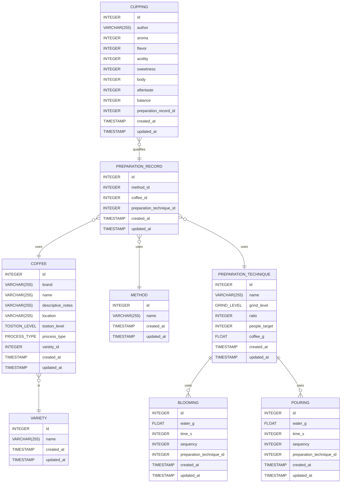

## Entity Relationship Diagram (ERD)

```mermaid
erDiagram
    COFFEE }o--|| VARIETY : is

    PREPARATION_RECORD }o--|| METHOD : uses
    PREPARATION_RECORD }o--|| COFFEE : uses
    PREPARATION_RECORD }o--|| PREPARATION_TECHNIQUE : uses

    CUPPING }o--|| PREPARATION_RECORD : qualifies

    PREPARATION_TECHNIQUE ||--o{ BLOOMING : uses
    PREPARATION_TECHNIQUE ||--o{ POURING : uses

    METHOD {
        INTEGER id
        VARCHAR(255) name 
        TIMESTAMP created_at
        TIMESTAMP updated_at
    }
    VARIETY {
        INTEGER id
        VARCHAR(255) name
        TIMESTAMP created_at
        TIMESTAMP updated_at
    }
    COFFEE {
        INTEGER id
        VARCHAR(255) brand
        VARCHAR(255) name
        VARCHAR(255) descriptive_notes
        VARCHAR(255) location
        TOSTION_LEVEL tostion_level
        PROCESS_TYPE process_type
        INTEGER variety_id
        TIMESTAMP created_at
        TIMESTAMP updated_at
    }
    PREPARATION_RECORD {
        INTEGER id
        INTEGER method_id
        INTEGER coffee_id
        INTEGER preparation_technique_id
        TIMESTAMP created_at
        TIMESTAMP updated_at
    }
    PREPARATION_TECHNIQUE {
        INTEGER id
        VARCHAR(255) name
        GRIND_LEVEL grind_level
        INTEGER ratio
        INTEGER people_target
        FLOAT coffee_g
        TIMESTAMP created_at
        TIMESTAMP updated_at
    }
    BLOOMING {
        INTEGER id
        FLOAT water_g
        INTEGER time_s
        INTEGER sequency
        INTEGER preparation_technique_id
        TIMESTAMP created_at
        TIMESTAMP updated_at
    }
    POURING {
        INTEGER id
        FLOAT water_g
        INTEGER time_s
        INTEGER sequency
        INTEGER preparation_technique_id
        TIMESTAMP created_at
        TIMESTAMP updated_at
    }
    CUPPING {
        INTEGER id
        VARCHAR(255) author
        INTEGER aroma
        INTEGER flavor
        INTEGER acidity
        INTEGER sweetness
        INTEGER body
        INTEGER aftertaste
        INTEGER balance
        INTEGER preparation_record_id
        TIMESTAMP created_at
        TIMESTAMP updated_at
    }
```

---

## License
This project is licensed under the [MIT License](./LICENSE).

## Author
* [Yenterick](https://github.com/Yenterick)
